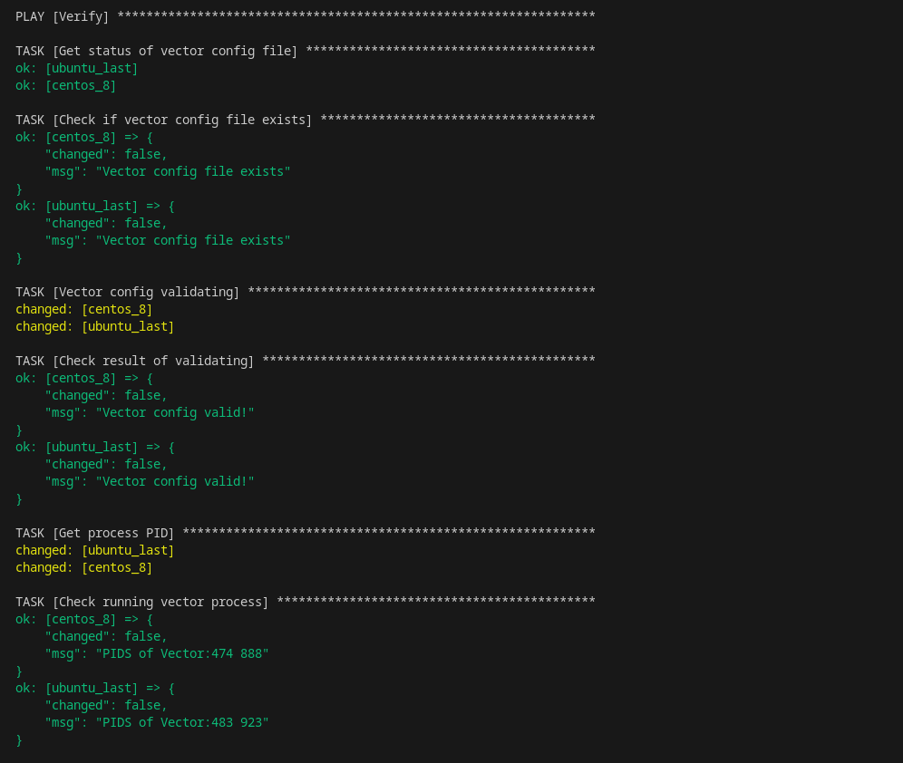
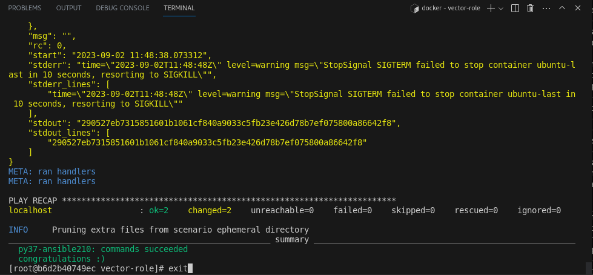
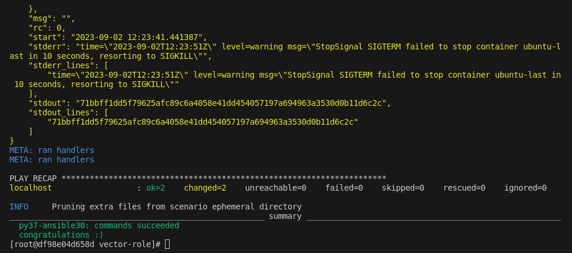

# Домашнеe заданиe по занятию "7.5 Тестирование roles"

## Скрины и логи выполнения команд по пунктам:

1. Molecule. Тестирование vector-role

Результат тестирования, этап verify:

[Лог тестирования vector-role](./applications/test_vector-role.log)

2. Tox. Тестирование vector-role

Результат тестирования tox (python 3.7, ansible 2.10):

Результат тестирования tox (python 3.7, ansible 3.0):

2. Тэги решений заданий:

1.1.1 - Решение по заданию molecule ([ссылка на git repo](https://github.com/Ditry86/ansible_study_5/releases/tag/1.1.1))

1.2.0 - Решение с двумя сценариями по заданию для tox ([ссылка на git repo](https://github.com/Ditry86/ansible_study_5/releases/tag/1.2.0))

